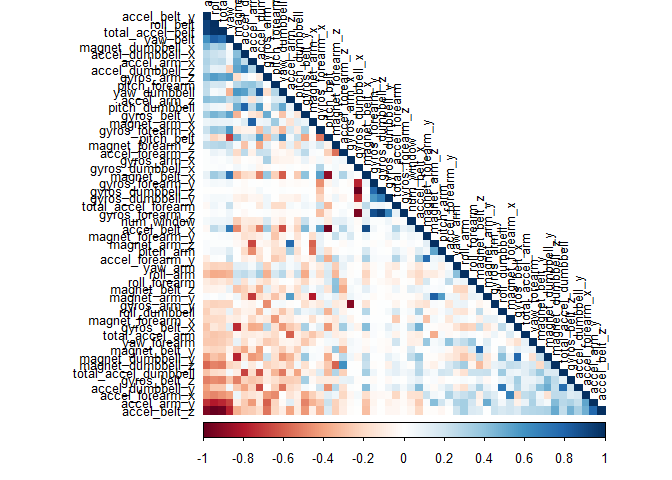
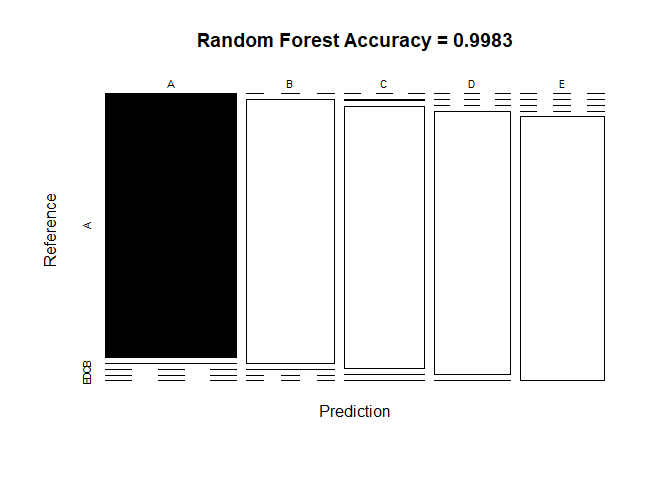
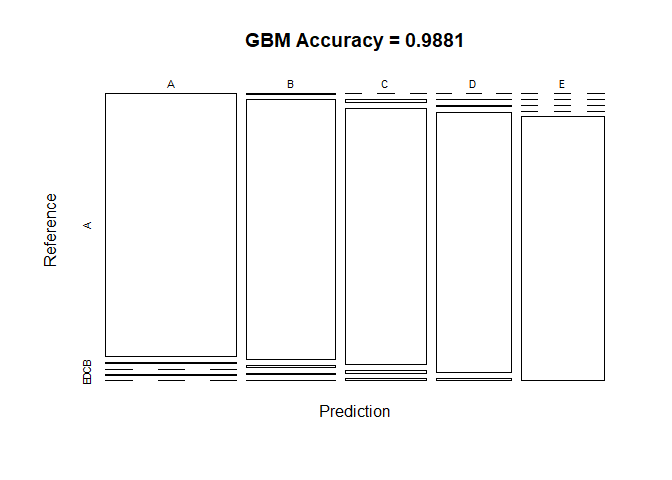

# **Overview**
This is the write-up part of the course project. The data is about a group of people doing barbell lifts correctly and incorrectly, as measured by on-body accelerometers. The goal is to predict, from this data, if the lift was made correctly or incorrectly. The source for this data is:

Velloso, E.; Bulling, A.; Gellersen, H.; Ugulino, W.; Fuks, H. **Qualitative Activity Recognition of Weight Lifting Exercises**. Proceedings of 4th International Conference in Cooperation with SIGCHI (Augmented Human '13) . Stuttgart, Germany: ACM SIGCHI, 2013.

Please visit my [github repository webpage](https://github.com/JerryMN/PracticalML) to view the complete code.

# **Setting up the environment**
## **Loading libraries**


```r
library(caret)
library(rpart)
library(rpart.plot)
library(rattle)
library(randomForest)
library(corrplot)
set.seed(123)
```

## **Loading and cleaning up the data**

```r
# Download and read the data
training <- read.csv("pml-training.csv")
testing <- read.csv("pml-testing.csv")

# Partition the data
inTrain <- createDataPartition(training$classe, p = 0.7, list = F)
trainset <- training[inTrain, ]
testset <- training[-inTrain, ]
dim(trainset)
```

```
## [1] 13737   160
```

In order to reduce the amount of variables (160) in the partitions, we will remove such variables with near zero variance.

```r
NZV <- nearZeroVar(trainset)
trainset <- trainset[, -NZV]
testset <- testset[, -NZV]
```

Now we only have 104 variables. However, we can further reduce this number by removing variables that are over 95% missing values. 

```r
isNA <- sapply(trainset, function(x) mean(is.na(x))) > 0.95
trainset <- trainset[, isNA == F]
testset <- testset[, isNA == F]
```

This results in 59 variables. Lastly, we will remove the first five columns as they are identification variables, and so at the end, we have 54 variables.

```r
trainset <- trainset[, -(1:5)]
testset <- testset[, -(1:5)]
dim(trainset)
```

```
## [1] 13737    54
```

Now we need to set the *classe* variable to be a factor instead of a character variable.

```r
trainset$classe <- as.factor(trainset$classe)
testset$classe <- as.factor(testset$classe)
```

# **Analysis**

The first step to my analysis is a correlation analysis before any actual modeling. The most strongly correlated variables appear in darker colors in the plot shown below.

```r
corrMatrix <- cor(trainset[, -54])
corrplot(corrMatrix, order = "FPC", method = "color", type = "lower",
         tl.cex = 0.8, tl.col = rgb(0, 0, 0))
```

<!-- -->

However, we are not interested in seeing the correlation between the variables, but rather how these variables as a whole can be used to predict *another* variable -- in this case, correctness of barlifts.

# **Prediction Model**
Now for the main part, fitting a model that best predicts the way the barlifts were made. To this end, we will use two different models, and the one with highest accuracy will be deemed the best one. These models are:

- Random Forests
- Generalized Boosted Model (GBM)

In addition, we are using the *trainControl()* function to apply a cross validation so we can reduce the sample error.

## **Random Forests**

```r
set.seed(123)
RFcontrol <- trainControl("cv", 3, verboseIter = F)
# Fitting the model
fit_rf <- train(classe ~., method = "rf", data = trainset, trcontrol = RFcontrol)
fit_rf
```

```
## Random Forest 
## 
## 13737 samples
##    53 predictor
##     5 classes: 'A', 'B', 'C', 'D', 'E' 
## 
## No pre-processing
## Resampling: Bootstrapped (25 reps) 
## Summary of sample sizes: 13737, 13737, 13737, 13737, 13737, 13737, ... 
## Resampling results across tuning parameters:
## 
##   mtry  Accuracy   Kappa    
##    2    0.9918623  0.9897040
##   27    0.9957242  0.9945902
##   53    0.9914190  0.9891447
## 
## Accuracy was used to select the optimal model using the largest value.
## The final value used for the model was mtry = 27.
```

Now we create the prediction, create a confusion matrix and plot it.

```r
predict_rf <- predict(fit_rf, newdata = testset)
confusionMat_rf <- confusionMatrix(predict_rf, testset$classe)
confusionMat_rf
```

```
## Confusion Matrix and Statistics
## 
##           Reference
## Prediction    A    B    C    D    E
##          A 1674    1    0    0    0
##          B    0 1135    1    0    0
##          C    0    3 1025    1    1
##          D    0    0    0  963    3
##          E    0    0    0    0 1078
## 
## Overall Statistics
##                                           
##                Accuracy : 0.9983          
##                  95% CI : (0.9969, 0.9992)
##     No Information Rate : 0.2845          
##     P-Value [Acc > NIR] : < 2.2e-16       
##                                           
##                   Kappa : 0.9979          
##                                           
##  Mcnemar's Test P-Value : NA              
## 
## Statistics by Class:
## 
##                      Class: A Class: B Class: C Class: D Class: E
## Sensitivity            1.0000   0.9965   0.9990   0.9990   0.9963
## Specificity            0.9998   0.9998   0.9990   0.9994   1.0000
## Pos Pred Value         0.9994   0.9991   0.9951   0.9969   1.0000
## Neg Pred Value         1.0000   0.9992   0.9998   0.9998   0.9992
## Prevalence             0.2845   0.1935   0.1743   0.1638   0.1839
## Detection Rate         0.2845   0.1929   0.1742   0.1636   0.1832
## Detection Prevalence   0.2846   0.1930   0.1750   0.1641   0.1832
## Balanced Accuracy      0.9999   0.9981   0.9990   0.9992   0.9982
```

```r
plot(confusionMat_rf$table, col = confusionMat_rf$byClass,
     main = paste("Random Forest Accuracy =", round(confusionMat_rf$overall["Accuracy"], 4)))
```

<!-- -->

## **Generalized Boosted Model (GBM)**

```r
set.seed(123)
GBMcontrol <- trainControl("repeatedcv", 5, 1)
fit_gbm <- train(classe ~., method = "gbm", data = trainset, trControl = GBMcontrol, verbose = F)
fit_gbm$finalModel
```

```
## A gradient boosted model with multinomial loss function.
## 150 iterations were performed.
## There were 53 predictors of which 53 had non-zero influence.
```

Now we create the prediction, create a confusion matrix and plot it.

```r
predict_gbm <- predict(fit_gbm, newdata = testset)
confusionMat_gbm <- confusionMatrix(predict_gbm, testset$classe)
confusionMat_gbm
```

```
## Confusion Matrix and Statistics
## 
##           Reference
## Prediction    A    B    C    D    E
##          A 1673    9    0    1    0
##          B    1 1117    8    7    2
##          C    0   12 1015   10    8
##          D    0    1    3  946    8
##          E    0    0    0    0 1064
## 
## Overall Statistics
##                                          
##                Accuracy : 0.9881         
##                  95% CI : (0.985, 0.9907)
##     No Information Rate : 0.2845         
##     P-Value [Acc > NIR] : < 2.2e-16      
##                                          
##                   Kappa : 0.985          
##                                          
##  Mcnemar's Test P-Value : NA             
## 
## Statistics by Class:
## 
##                      Class: A Class: B Class: C Class: D Class: E
## Sensitivity            0.9994   0.9807   0.9893   0.9813   0.9834
## Specificity            0.9976   0.9962   0.9938   0.9976   1.0000
## Pos Pred Value         0.9941   0.9841   0.9713   0.9875   1.0000
## Neg Pred Value         0.9998   0.9954   0.9977   0.9963   0.9963
## Prevalence             0.2845   0.1935   0.1743   0.1638   0.1839
## Detection Rate         0.2843   0.1898   0.1725   0.1607   0.1808
## Detection Prevalence   0.2860   0.1929   0.1776   0.1628   0.1808
## Balanced Accuracy      0.9985   0.9884   0.9916   0.9894   0.9917
```

```r
plot(confusionMat_gbm$table, col = confusionMat_gbm$byClass, 
    main = paste("GBM Accuracy =", round(confusionMat_gbm$overall["Accuracy"], 4)))
```

<!-- -->

# **Sample Error and Out of Sample Error**
We know that the most accurate model is Random Forests, with an accuracy of

```r
acc_rf <- confusionMat_rf$overall["Accuracy"]
acc_rf
```

```
##  Accuracy 
## 0.9983008
```

Thus, we can calculate the sample error as follows:

```r
1 - acc_rf
```

```
##    Accuracy 
## 0.001699235
```

Since the out of sample error is always larger than the sample error, we can infer that the out of sample error will be bigger than 0.17%

# **Predicting**
Since the best model as measured by accuracy is Random Forests, we will use this model to show the predictions for the 20 test values, which are as follows.

```r
results <- predict(fit_rf, newdata = testing)
results
```

```
##  [1] B A B A A E D B A A B C B A E E A B B B
## Levels: A B C D E
```
