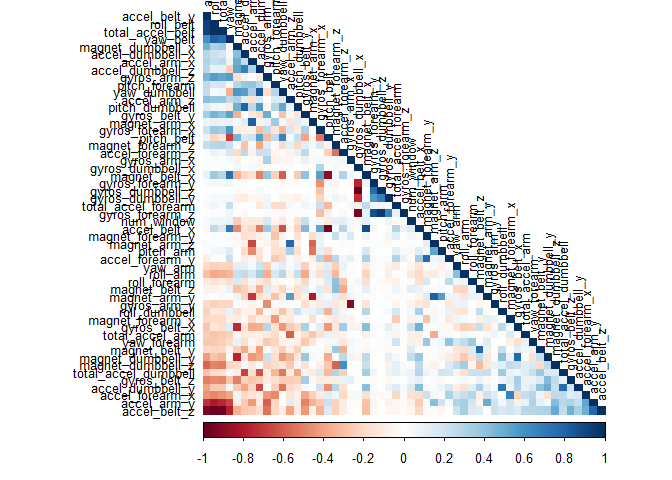
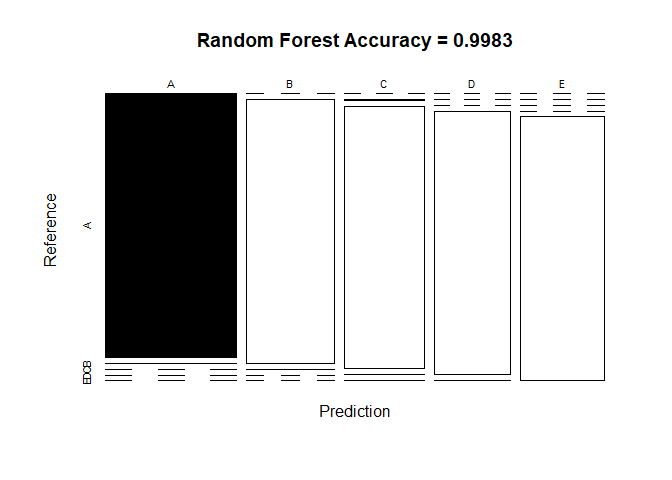
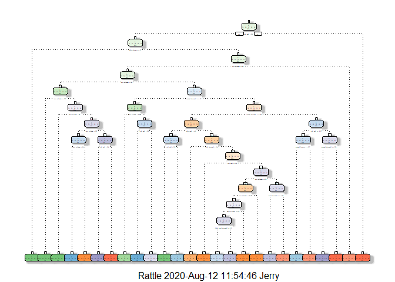
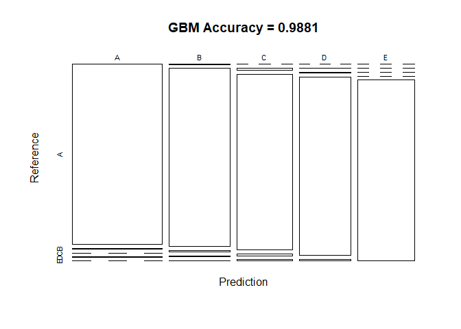

# **Overview**
This is the write-up part of the course project. The data is about a group of people doing barbell lifts correctly and incorrectly, as measured by on-body accelerometers. The goal is to predict, from this data, if the lift was made correctly or incorrectly. The source for this data is:

Velloso, E.; Bulling, A.; Gellersen, H.; Ugulino, W.; Fuks, H. **Qualitative Activity Recognition of Weight Lifting Exercises**. Proceedings of 4th International Conference in Cooperation with SIGCHI (Augmented Human '13) . Stuttgart, Germany: ACM SIGCHI, 2013.

# **Setting up the environment**
## **Loading libraries**


```r
library(caret)
library(rpart)
library(rpart.plot)
library(rattle)
library(randomForest)
library(corrplot)
set.seed(123)
```

## **Loading and cleaning up the data**

```r
# Download and read the data
training <- read.csv(url("https://d396qusza40orc.cloudfront.net/predmachlearn/pml-training.csv"))
testing <- read.csv(url("https://d396qusza40orc.cloudfront.net/predmachlearn/pml-testing.csv"))

# Partition the data
inTrain <- createDataPartition(training$classe, p = 0.7, list = F)
trainset <- training[inTrain, ]
testset <- training[-inTrain, ]
```

In order to reduce the amount of variables (160) in the partitions, we will remove such variables with near zero variance.

```r
NZV <- nearZeroVar(trainset)
trainset <- trainset[, -NZV]
testset <- testset[, -NZV]
```

Now we only have 104 variables. However, we can further reduce this number by removing variables that are over 95% missing values. 

```r
isNA <- sapply(trainset, function(x) mean(is.na(x))) > 0.95
trainset <- trainset[, isNA == F]
testset <- testset[, isNA == F]
```

This results in 59 variables. Lastly, we will remove the first five columns as they are identification variables, and so at the end, we have 54 variables.

```r
trainset <- trainset[, -(1:5)]
testset <- testset[, -(1:5)]
```

Now we need to set the *classe* variable to be a factor instead of a character variable.

```r
trainset$classe <- as.factor(trainset$classe)
testset$classe <- as.factor(testset$classe)
```

# **Analysis**

The first step to my analysis is a correlation analysis before any actual modeling. The most strongly correlated variables appear in darker colors in the plot shown below. 

```r
corrMatrix <- cor(trainset[, -54])
corrplot(corrMatrix, order = "FPC", method = "color", type = "lower",
         tl.cex = 0.8, tl.col = rgb(0, 0, 0))
```

<!-- -->

# **Prediction Model**
Now for the main part, fitting a model that best predicts the way the barlifts were made. To this end, I will use three different models, and the one with highest accuracy will be deemed the best one. These models are:

- Random Forests
- Decision Tree
- Generalized Boosted Model (GBM)

## **Random Forests**

```r
set.seed(123)
# Using trainControl() to control computational nuances.
RFcontrol <- trainControl("cv", 3, verboseIter = F)
# Fitting the model
fit_rf <- train(classe ~., method = "rf", data = trainset, trcontrol = RFcontrol)
fit_rf$finalModel
```

```
## 
## Call:
##  randomForest(x = x, y = y, mtry = param$mtry, trcontrol = ..1) 
##                Type of random forest: classification
##                      Number of trees: 500
## No. of variables tried at each split: 27
## 
##         OOB estimate of  error rate: 0.25%
## Confusion matrix:
##      A    B    C    D    E  class.error
## A 3904    1    0    0    1 0.0005120328
## B    6 2647    5    0    0 0.0041384500
## C    0    7 2389    0    0 0.0029215359
## D    0    0    9 2242    1 0.0044404973
## E    0    0    0    5 2520 0.0019801980
```

Now we create the prediction, create a confusion matrix and plot it.

```r
predict_rf <- predict(fit_rf, newdata = testset)
confusionMat_rf <- confusionMatrix(predict_rf, testset$classe)
confusionMat_rf
```

```
## Confusion Matrix and Statistics
## 
##           Reference
## Prediction    A    B    C    D    E
##          A 1674    1    0    0    0
##          B    0 1135    1    0    0
##          C    0    3 1025    1    1
##          D    0    0    0  963    3
##          E    0    0    0    0 1078
## 
## Overall Statistics
##                                           
##                Accuracy : 0.9983          
##                  95% CI : (0.9969, 0.9992)
##     No Information Rate : 0.2845          
##     P-Value [Acc > NIR] : < 2.2e-16       
##                                           
##                   Kappa : 0.9979          
##                                           
##  Mcnemar's Test P-Value : NA              
## 
## Statistics by Class:
## 
##                      Class: A Class: B Class: C Class: D Class: E
## Sensitivity            1.0000   0.9965   0.9990   0.9990   0.9963
## Specificity            0.9998   0.9998   0.9990   0.9994   1.0000
## Pos Pred Value         0.9994   0.9991   0.9951   0.9969   1.0000
## Neg Pred Value         1.0000   0.9992   0.9998   0.9998   0.9992
## Prevalence             0.2845   0.1935   0.1743   0.1638   0.1839
## Detection Rate         0.2845   0.1929   0.1742   0.1636   0.1832
## Detection Prevalence   0.2846   0.1930   0.1750   0.1641   0.1832
## Balanced Accuracy      0.9999   0.9981   0.9990   0.9992   0.9982
```

```r
plot(confusionMat_rf$table, col = confusionMat_rf$byClass,
     main = paste("Random Forest Accuracy =", round(confusionMat_rf$overall["Accuracy"], 4)))
```

<!-- -->

## **Decision Trees**

```r
set.seed(123)
fit_dt <- rpart(classe ~., method = "class", data = trainset)
fancyRpartPlot(fit_dt)
```

<!-- -->

Now we create the prediction, create a confusion matrix and plot it.

```r
predict_dt <- predict(fit_dt, newdata = testset, type = "class")
confusionMat_dt <- confusionMatrix(predict_dt, testset$classe)
confusionMat_dt
```

```
## Confusion Matrix and Statistics
## 
##           Reference
## Prediction    A    B    C    D    E
##          A 1459   86    0   13    2
##          B  104  855   61   75   51
##          C    0   57  856   37    3
##          D   92   81   99  759   86
##          E   19   60   10   80  940
## 
## Overall Statistics
##                                           
##                Accuracy : 0.8274          
##                  95% CI : (0.8175, 0.8369)
##     No Information Rate : 0.2845          
##     P-Value [Acc > NIR] : < 2.2e-16       
##                                           
##                   Kappa : 0.7823          
##                                           
##  Mcnemar's Test P-Value : NA              
## 
## Statistics by Class:
## 
##                      Class: A Class: B Class: C Class: D Class: E
## Sensitivity            0.8716   0.7507   0.8343   0.7873   0.8688
## Specificity            0.9760   0.9387   0.9800   0.9273   0.9648
## Pos Pred Value         0.9353   0.7461   0.8982   0.6795   0.8476
## Neg Pred Value         0.9503   0.9401   0.9655   0.9570   0.9703
## Prevalence             0.2845   0.1935   0.1743   0.1638   0.1839
## Detection Rate         0.2479   0.1453   0.1455   0.1290   0.1597
## Detection Prevalence   0.2651   0.1947   0.1619   0.1898   0.1884
## Balanced Accuracy      0.9238   0.8447   0.9072   0.8573   0.9168
```

```r
plot(confusionMat_dt$table, col = confusionMat_dt$byClass,
    main = paste("Decision Trees Accuracy =", round(confusionMat_dt$overall["Accuracy"], 4)))
```

<!-- -->

## **Generalized Boosted Model (GBM)**

```r
set.seed(123)
GBMcontrol <- trainControl("repeatedcv", 5, 1)
fit_gbm <- train(classe ~., method = "gbm", data = trainset, trControl = GBMcontrol, verbose = F)
fit_gbm$finalModel
```

```
## A gradient boosted model with multinomial loss function.
## 150 iterations were performed.
## There were 53 predictors of which 53 had non-zero influence.
```

Now we create the prediction, create a confusion matrix and plot it.

```r
predict_gbm <- predict(fit_gbm, newdata = testset)
confusionMat_gbm <- confusionMatrix(predict_gbm, testset$classe)
confusionMat_gbm
```

```
## Confusion Matrix and Statistics
## 
##           Reference
## Prediction    A    B    C    D    E
##          A 1673    9    0    1    0
##          B    1 1117    8    7    2
##          C    0   12 1015   10    8
##          D    0    1    3  946    8
##          E    0    0    0    0 1064
## 
## Overall Statistics
##                                          
##                Accuracy : 0.9881         
##                  95% CI : (0.985, 0.9907)
##     No Information Rate : 0.2845         
##     P-Value [Acc > NIR] : < 2.2e-16      
##                                          
##                   Kappa : 0.985          
##                                          
##  Mcnemar's Test P-Value : NA             
## 
## Statistics by Class:
## 
##                      Class: A Class: B Class: C Class: D Class: E
## Sensitivity            0.9994   0.9807   0.9893   0.9813   0.9834
## Specificity            0.9976   0.9962   0.9938   0.9976   1.0000
## Pos Pred Value         0.9941   0.9841   0.9713   0.9875   1.0000
## Neg Pred Value         0.9998   0.9954   0.9977   0.9963   0.9963
## Prevalence             0.2845   0.1935   0.1743   0.1638   0.1839
## Detection Rate         0.2843   0.1898   0.1725   0.1607   0.1808
## Detection Prevalence   0.2860   0.1929   0.1776   0.1628   0.1808
## Balanced Accuracy      0.9985   0.9884   0.9916   0.9894   0.9917
```

```r
plot(confusionMat_gbm$table, col = confusionMat_gbm$byClass, 
    main = paste("GBM Accuracy =", round(confusionMat_gbm$overall["Accuracy"], 4)))
```

<!-- -->

# Predicting 
Since the best model as measured by accuracy is Random Forests, we will use this model to predict the values.

```r
results <- predict(fit_rf, newdata = testing)
results
```

```
##  [1] B A B A A E D B A A B C B A E E A B B B
## Levels: A B C D E
```
